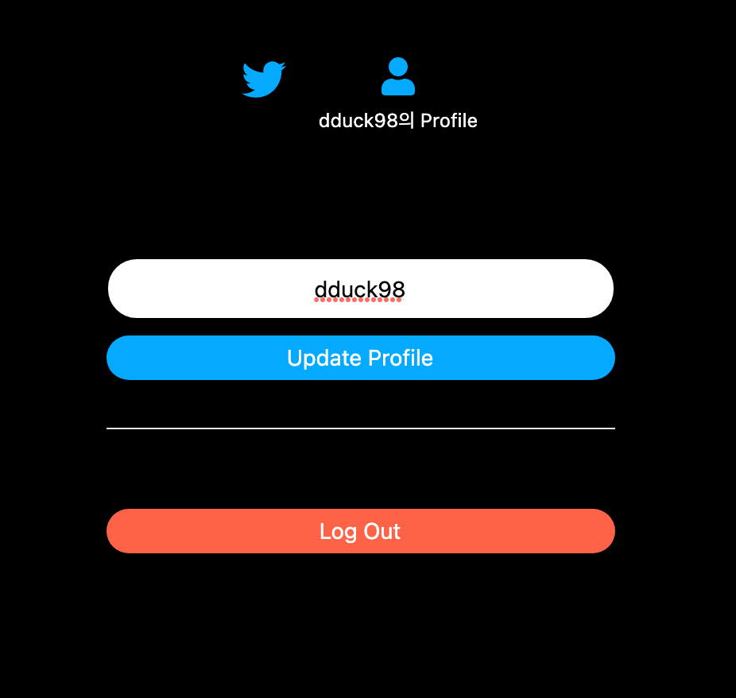

# 트위터 클론코딩

## 기술 스택 🧑‍💻

- 프론트

  - React
  - Javascript
  - FontAwesome

- 백엔드

  - Firebase

- 모듈
  - Webpack
  - npm

---

## 로그인 화면

> 로그인 화면입니다, create Account를 이용하여 계정을 따로 만들 수도 있고, 구글이나 깃허브로 로그인을 할 수 있게 만들었습니다.

## 메인 화면

> 트윗 수정 및 삭제, 트윗을 올릴 수 있습니다.

### 트윗 및 이미지 올리기

## 프로필 화면

> 로그아웃 및 프로필 닉네임을 변경할 수 있습니다.

### 닉네임 바꾸기

